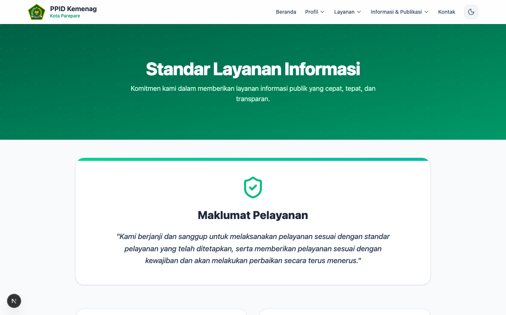
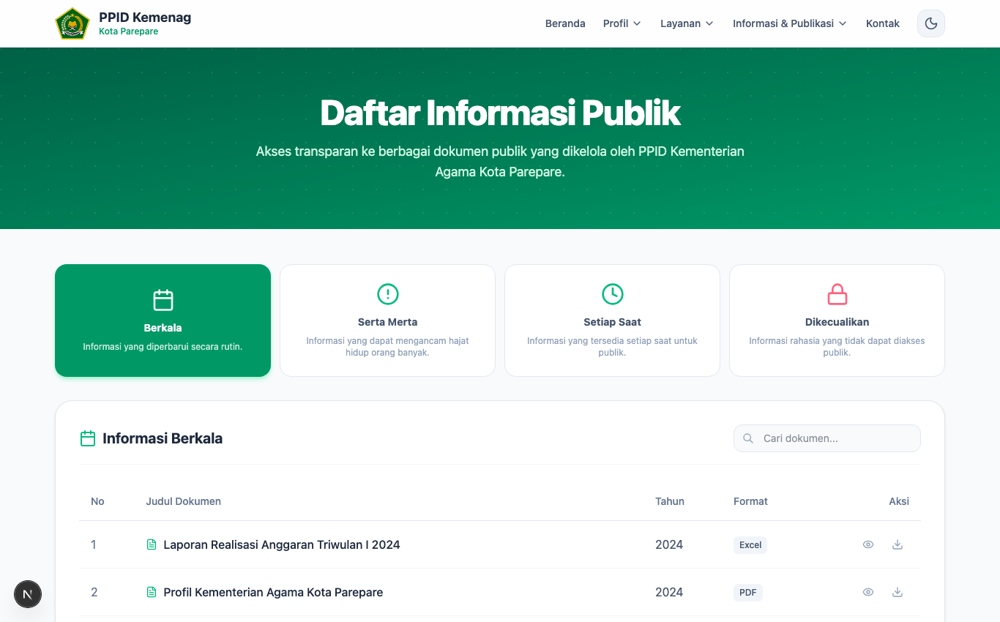
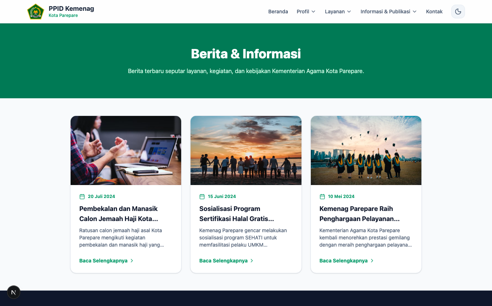
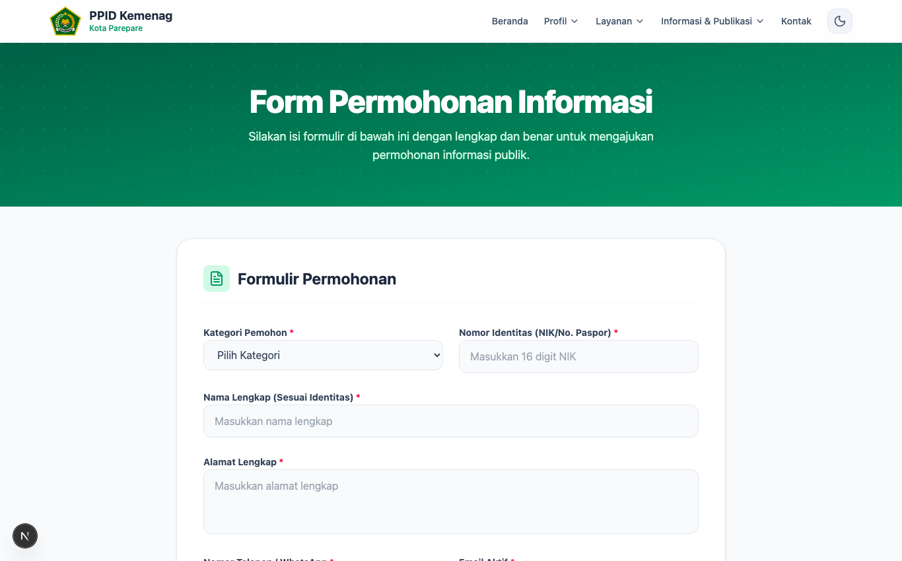
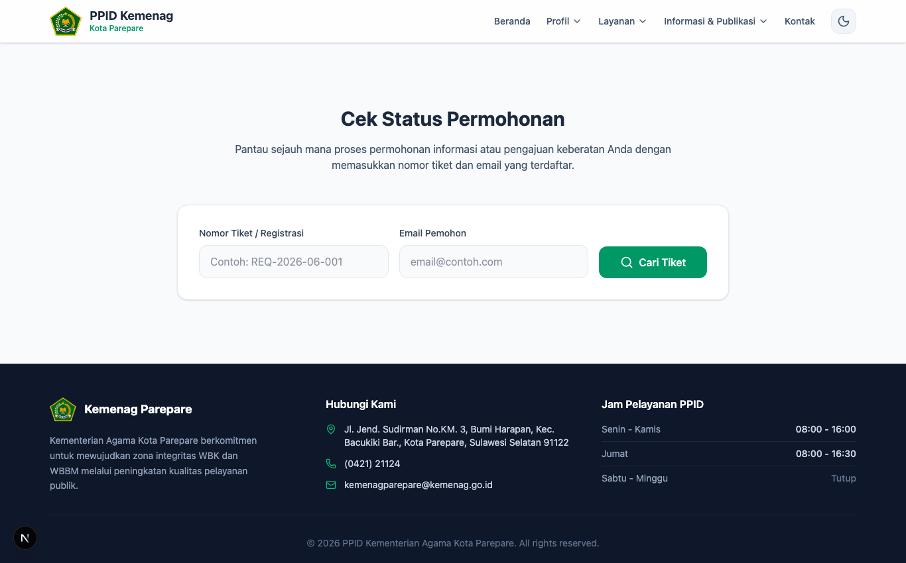
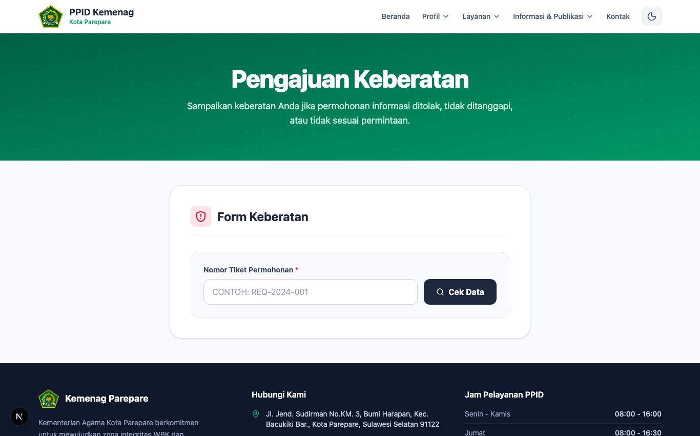
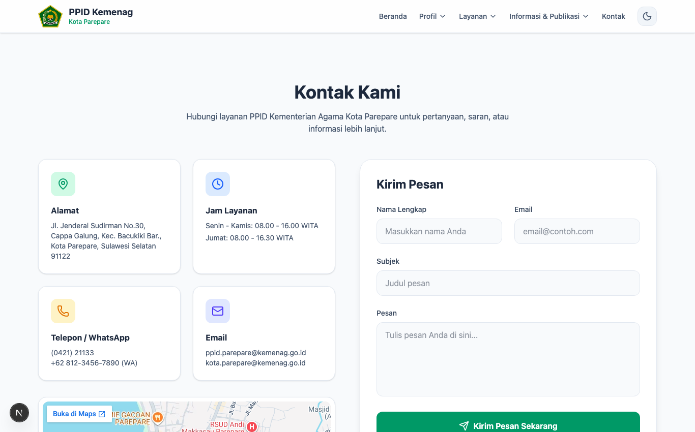

# 📘 BUKU PANDUAN LAYANAN INFORMASI PUBLIK
## Panduan Hak Asasi, Prosedur Permohonan, Lacak Berkas & Keberatan bagi Masyarakat
### Pejabat Pengelola Informasi dan Dokumentasi (PPID)
#### Kantor Kementerian Agama Kota Parepare
**Edisi Super Lengkap: Petunjuk Praktis bagi Warga Negara, Peneliti, Mahasiswa, Lembaga Swadaya Masyarakat (LSM) & Media Massa**

---

## 📑 DAFTAR ISI LENGKAP
1. [Hak Konstitusional & Landasan Hukum Keterbukaan Informasi Publik](#1-hak-konstitusional--landasan-hukum-keterbukaan-informasi-publik)
2. [Kategori Pemohon & Persyaratan Dokumen Administrasi](#2-kategori-pemohon--persyaratan-dokumen-administrasi)
3. [Kamus Istilah Resmi Keterbukaan Informasi Publik](#3-kamus-istilah-resmi-keterbukaan-informasi-publik)
4. [Direktori Lengkap Tautan (URL) Layanan Publik Portal PPID](#4-direktori-lengkap-tautan-url-layanan-publik-portal-ppid)
5. [Peta Layanan & Ruang Lingkup Informasi di Kemenag Kota Parepare](#5-peta-layanan--ruang-lingkup-informasi-di-kemenag-kota-parepare)
6. [Jaminan Biaya Bebas (Rp 0,- GRATIS), Waktu Respon & Maklumat Pelayanan](#6-jaminan-biaya-bebas-rp-0--gratis-waktu-respon--maklumat-pelayanan)
7. [Klasifikasi 4 Kategori Informasi & Cara Mengunduh Dokumen DIP](#7-klasifikasi-4-kategori-informasi--cara-mengunduh-dokumen-dip)
8. [Menyimak Warta & Dokumentasi Kegiatan Keagamaan Resmi](#8-menyimak-warta--dokumentasi-kegiatan-keagamaan-resmi)
9. [Panduan Langkah-demi-Langkah Pengajuan Permohonan Informasi Online](#9-panduan-langkah-demi-langkah-pengajuan-permohonan-informasi-online)
10. [Tata Cara Melacak Status Berkas (Cek Status Tiket Real-Time)](#10-tata-cara-melacak-status-berkas-cek-status-tiket-real-time)
11. [Metode Pengambilan Dokumen (Unduhan Digital vs Meja Layanan PTSP)](#11-metode-pengambilan-dokumen-unduhan-digital-vs-meja-layanan-ptsp)
12. [Tata Cara & 7 Alasan Sah Mengajukan Keberatan Informasi Publik](#12-tata-cara--7-alasan-sah-mengajukan-keberatan-informasi-publik)
13. [Mekanisme Penyelesaian Sengketa ke Komisi Informasi (KI) Sulsel](#13-mekanisme-penyelesaian-sengketa-ke-komisi-informasi-ki-sulsel)
14. [Fasilitas Ramah Disabilitas & Layanan Pendampingan Khusus](#14-fasilitas-ramah-disabilitas--layanan-pendampingan-khusus)
15. [Alamat Fisik Gedung PTSP, Jam Operasional & Direktori KUA Kecamatan](#15-alamat-fisik-gedung-ptsp-jam-operasional--direktori-kua-kecamatan)
16. [Tanya Jawab Praktis (FAQ) Seputar Layanan PPID Kemenag Parepare](#16-tanya-jawab-praktis-faq-seputar-layanan-ppid-kemenag-parepare)

---

## 1. Hak Konstitusional & Landasan Hukum Keterbukaan Informasi Publik

Keterbukaan informasi publik merupakan instrumen utama dalam mewujudkan kedaulatan rakyat dan tata kelola pemerintahan yang bersih dari korupsi, kolusi, dan nepotisme (KKN).

### A. Jaminan Konstitusi UUD 1945:
* **Pasal 28F UUD 1945:** *"Setiap orang berhak untuk berkomunikasi dan memperoleh informasi untuk mengembangkan pribadi dan lingkungan sosialnya, serta berhak untuk mencari, memperoleh, memiliki, menyimpan, mengolah, dan menyampaikan informasi dengan menggunakan segala jenis saluran yang tersedia."*

### B. Landasan Undang-Undang & Regulasi:
1. **UU No. 14 Tahun 2008 tentang Keterbukaan Informasi Publik (UU KIP):** Menetapkan bahwa setiap informasi publik bersifat terbuka dan dapat diakses oleh setiap pengguna informasi publik, kecuali informasi publik yang dikecualikan bersifat ketat dan terbatas.
2. **PMA No. 9 Tahun 2022 tentang Pedoman Pengelolaan Informasi dan Dokumentasi pada Kementerian Agama:** Menjamin seluruh satuan kerja Kementerian Agama memiliki standar layanan informasi yang transparan dan akuntabel.
3. **Perki No. 1 Tahun 2021 tentang Standar Layanan Informasi Publik (SLIP):** Menjamin hak pemohon mendapatkan respon paling lambat 10 hari kerja.

### C. Hak-Hak Pokok Pemohon Informasi:
* Melihat dan mengetahui informasi publik yang dikuasai oleh Kementerian Agama Kota Parepare.
* Menghadiri pertemuan publik yang terbuka untuk umum.
* Mendapatkan salinan dokumen informasi publik melalui permohonan resmi secara cuma-cuma (bebas biaya retribusi).
* Mengajukan keberatan tertulis kepada Atasan PPID apabila permohonan diabaikan atau ditolak tanpa dasar hukum.
* Mengajukan sengketa informasi ke Komisi Informasi apabila proses keberatan tidak membuahkan keadilan.

---

## 2. Kategori Pemohon & Persyaratan Dokumen Administrasi

Untuk menjaga ketertiban administrasi dan pertanggungjawaban hukum, pemohon informasi diklasifikasikan ke dalam 4 kategori dengan syarat dokumen identitas:

| Kategori Pemohon | Syarat Dokumen Identitas | Contoh Keperluan / Tujuan Permohonan |
| :--- | :--- | :--- |
| **1. Perorangan WNI** | Foto / Scan Kartu Tanda Penduduk (KTP) Elektronik yang masih berlaku dan terbaca jelas. | Kepentingan pribadi, transparansi nikah di KUA, cek estimasi haji, atau advokasi warga. |
| **2. Kelompok Orang** | Surat Kuasa bermaterai dari perwakilan kelompok serta scan KTP pemberi dan penerima kuasa. | Aspirasi kelompok masyarakat rukun tetangga, asosiasi pengusaha travel umrah, atau jamaah masjid. |
| **3. Badan Hukum / LSM / Media** | Akta Notaris pendirian / SK Kemenkumham, AD/ART organisasi, dan scan KTP pimpinan lembaga/wartawan. | Investigasi jurnalistik, riset independen lembaga swadaya masyarakat, audit sosial anggaran. |
| **4. Peneliti / Mahasiswa** | Scan Kartu Tanda Mahasiswa (KTM) / KTP serta Surat Izin Penelitian dari Kampus atau PTSP Parepare. | Pengambilan data primer skripsi, tesis, disertasi, atau riset akademis keagamaan. |

---

## 3. Kamus Istilah Resmi Keterbukaan Informasi Publik

Berikut adalah glosarium istilah hukum resmi untuk mempermudah masyarakat memahami bahasa administrasi PPID:

* **Badan Publik:** Lembaga eksekutif, legislatif, yudikatif, dan badan lain yang tugas pokoknya berkaitan dengan penyelenggaraan negara yang dananya bersumber dari APBN/APBD.
* **Informasi Publik:** Informasi yang dihasilkan, disimpan, dikelola, dikirim, dan/atau diterima oleh badan publik yang berkaitan dengan penyelenggaraan negara.
* **Daftar Informasi Publik (DIP):** Catatan resmi yang memuat ringkasan seluruh dokumen informasi publik yang berada di bawah penguasaan badan publik.
* **Informasi yang Dikecualikan:** Informasi yang tidak dapat diakses oleh pemohon informasi publik karena dapat membahayakan pertahanan negara, rahasia bisnis, atau hak-hak pribadi berdasarkan Uji Konsekuensi.
* **Uji Konsekuensi:** Proses pengujian substantif yang wajib dilakukan oleh badan publik sebelum menetapkan suatu informasi sebagai rahasia.
* **Atasan PPID:** Pejabat struktural yang merupakan atasan langsung PPID (pada instansi ini dijabat oleh Kepala Kantor Kemenag Kota Parepare).
* **Komisi Informasi (KI):** Lembaga independen yang bertugas menyelesaikan sengketa informasi publik melalui mediasi dan/atau ajudikasi nonlitigasi.

---

## 4. Direktori Lengkap Tautan (URL) Layanan Publik Portal PPID

Seluruh fitur layanan publik pada portal PPID Kementerian Agama Kota Parepare dapat diakses secara mandiri melalui tautan berikut:

| Nama Layanan Publik | URL Relatif | Tautan Langsung di Browser | Deskripsi & Manfaat Bagi Masyarakat |
| :--- | :--- | :--- | :--- |
| **Beranda Portal Utama** | `/` | `https://ppidparepare.vercel.app/` | Pintu utama informasi, berita terhangat, dan rangkuman statistik transparansi. |
| **Profil Lembaga** | `/profil` | `https://ppidparepare.vercel.app/profil` | Mengenal sejarah kantor, visi-misi, serta bagan struktur pejabat PPID Kemenag. |
| **Standar Layanan & SOP** | `/standar-layanan` | `https://ppidparepare.vercel.app/standar-layanan` | Mempelajari bagan alur permohonan, alur keberatan, dan komitmen maklumat pelayanan. |
| **Daftar Informasi Publik (DIP)** | `/informasi-publik` | `https://ppidparepare.vercel.app/informasi-publik` | Mengunduh langsung dokumen resmi (Renstra, LKjIP, SOP Nikah KUA, Laporan Aset BMN). |
| **Warta & Berita Kemenag** | `/berita` | `https://ppidparepare.vercel.app/berita` | Membaca kabar kegiatan keagamaan, madrasah, haji, zakat, dan kerukunan umat. |
| **Formulir Permohonan Online**| `/ajukan-permohonan`| `https://ppidparepare.vercel.app/ajukan-permohonan` | Mengajukan permohonan data/informasi secara online dari laptop atau HP Anda. |
| **Lacak / Cek Status Tiket** | `/cek-status` | `https://ppidparepare.vercel.app/cek-status` | Memantau tahapan verifikasi dokumen Anda secara real-time via nomor tiket registrasi. |
| **Formulir Pengajuan Keberatan**| `/pengajuan-keberatan`| `https://ppidparepare.vercel.app/pengajuan-keberatan`| Mengajukan sanggahan resmi langsung kepada Atasan PPID jika layanan terhambat. |
| **Galeri Foto Kegiatan** | `/galeri` | `https://ppidparepare.vercel.app/galeri` | Dokumentasi visual kegiatan pembinaan, sosialisasi, dan pelayanan kantor. |
| **Regulasi & Peraturan** | `/regulasi` | `https://ppidparepare.vercel.app/regulasi` | Mengunduh dokumen hukum UU No. 14/2008, PP No. 61/2010, dan PMA No. 9/2022. |
| **Bantuan & Tanya Jawab (FAQ)**| `/faq` | `https://ppidparepare.vercel.app/faq` | Menemukan jawaban cepat atas pertanyaan yang sering diajukan masyarakat. |
| **Kontak & Ruang Layanan PTSP**| `/kontak` | `https://ppidparepare.vercel.app/kontak` | Alamat fisik gedung PTSP, peta lokasi, nomor WhatsApp helpdesk, dan formulir pesan. |
| **Unduh Panduan Pemohon (PDF)**| `/BUKU_PANDUAN_PEMOHON_INFORMASI.pdf` | `https://ppidparepare.vercel.app/BUKU_PANDUAN_PEMOHON_INFORMASI.pdf` | Mengunduh buku panduan resmi ini dalam format PDF siap baca dan simpan. |

---

## 5. Peta Layanan & Ruang Lingkup Informasi di Kemenag Kota Parepare

Masyarakat dapat meminta informasi publik yang berkaitan dengan tugas pokok dan fungsi satuan kerja di lingkungan Kemenag Kota Parepare:

1. **Seksi Bimbingan Masyarakat Islam (Bimas Islam):**
   - Prosedur pendaftaran nikah di KUA (biaya Rp 0,- di KUA pada hari dan jam kerja).
   - Data statistik rumah ibadah (masjid/mushalla), data penghulu dan penyuluh agama Islam se-Kota Parepare.
   - Layanan hisab rukyat penentuan awal bulan Hijriyah dan permohonan kalibrasi arah kiblat gratis.
2. **Seksi Pendidikan Madrasah (Penmad):**
   - Data penyaluran Bantuan Operasional Sekolah (BOS) Madrasah (MI, MTs, MA).
   - Data penerima Program Indonesia Pintar (PIP) bagi siswa madrasah kurang mampu.
   - Informasi akreditasi madrasah dan tunjangan profesi guru madrasah.
3. **Seksi Pendidikan Agama Islam (PAIS):**
   - Data persebaran guru Pendidikan Agama Islam (PAI) pada sekolah umum (TK, SD, SMP, SMA, SMK).
   - Informasi pelaksanaan Program Pengembangan Keprofesian Berkelanjutan (PPKB) GPAI.
4. **Seksi Pendidikan Diniyah & Pondok Pesantren (PD Pontren):**
   - Data legalitas dan izin operasional pondok pesantren di Kota Parepare.
   - Data Madrasah Diniyah Takmiliyah (MDT) dan Lembaga Pendidikan Al-Qur'an (LPQ).
5. **Seksi Penyelenggaraan Haji & Umrah (PHU):**
   - Prosedur pendaftaran porsi haji reguler, syarat pelunasan Bipih, dan estimasi tahun keberangkatan haji.
   - Daftar biro perjalanan umrah resmi (PPIU) yang memiliki izin operasional terdaftar.
6. **Penyelenggara Zakat & Wakaf (Zawa):**
   - Panduan sertifikasi tanah wakaf gratis bekerja sama dengan Kementerian ATR/BPN.
   - Data luas persebaran tanah wakaf dan koordinasi pembinaan Badan Amil Zakat Nasional (BAZNAS).
7. **Subbagian Tata Usaha (Subbag TU):**
   - Dokumen perencanaan anggaran (DIPA/RKA-K/L), Laporan Akuntabilitas Kinerja (LKjIP), dan Daftar Barang Milik Negara (BMN).

---

## 6. Jaminan Biaya Bebas (Rp 0,- GRATIS), Waktu Respon & Maklumat Pelayanan



### Jaminan Pelayanan Bebas Biaya (Gratis):
* Seluruh pelayanan informasi publik digital, pengisian formulir, konsultasi di loket PTSP, serta pengunduhan dokumen digital pada portal PPID diberikan secara **GRATIS (Rp 0,-)** tanpa pungutan biaya retribusi apapun.
* Pemohon hanya menanggung biaya fotokopi mandiri atau ongkos kirim pos apabila meminta salinan berkas cetak fisik dalam volume besar.

### Standar Jangka Waktu Respon (10 + 7 Hari Kerja):
* **Maksimal 10 (sepuluh) hari kerja** sejak permohonan diterima lengkap bagi PPID untuk menyampaikan Surat Pemberitahuan Tertulis (Disetujui, Ditolak, atau Diperpanjang).
* **Perpanjangan waktu maksimal 7 (tujuh) hari kerja** tambahan apabila dokumen yang diminta memerlukan penelusuran arsip yang luas atau koordinasi antar satker (wajib disertai alasan tertulis resmi).

### Maklumat Pelayanan PPID:
> *"Dengan ini, kami menyatakan sanggup menyelenggarakan pelayanan informasi publik sesuai dengan standar pelayanan yang telah ditetapkan dan apabila tidak menepati janji ini, kami siap menerima sanksi sesuai dengan peraturan perundang-undangan yang berlaku."*

---

## 7. Klasifikasi 4 Kategori Informasi & Cara Mengunduh Dokumen DIP



Masyarakat dapat langsung mengunduh ribuan dokumen pada katalog Daftar Informasi Publik (DIP) tanpa harus menunggu proses verifikasi:

1. **Informasi Berkala:** Dokumen yang dimutakhirkan rutin. Contoh: Renstra Kemenag, LKjIP, Buku Profil Statistik Keagamaan, dan Laporan Realisasi Anggaran.
2. **Informasi Setiap Saat:** Dokumen operasional sehari-hari. Contoh: Standar Pelayanan PTSP, SOP Nikah KUA, Daftar Inventaris Aset/BMN, dan Struktur Organisasi.
3. **Informasi Serta Merta:** Informasi darurat yang menyangkut keamanan masyarakat. Contoh: Peringatan modus penipuan mengatasnamakan beasiswa pesantren atau haji/umrah.
4. **Informasi Dikecualikan:** Dokumen rahasia yang tidak dipublikasikan karena memuat data pribadi atau rahasia audit internal negara.

### Cara Mengunduh Dokumen di Portal:
1. Buka halaman `/informasi-publik`.
2. Gunakan bilah pencarian dengan mengetik kata kunci berkas yang Anda cari (misal: *Renstra*, *SOP*, *Statistik*).
3. Klik tab filter kategori informasi jika diperlukan.
4. Klik tombol **Unduh Dokumen** untuk menyimpan berkas (format PDF/Word/Excel) ke perangkat Anda.

---

## 8. Menyimak Warta & Dokumentasi Kegiatan Keagamaan Resmi



Masyarakat dapat memantau keterbukaan kinerja aparatur sipil negara melalui modul warta liputan kegiatan resmi pada menu `/berita`. Setiap artikel dilengkapi tanggal rilis, foto liputan lapangan, serta ringkasan narasi yang informatif.

---

## 9. Panduan Langkah-demi-Langkah Pengajuan Permohonan Informasi Online

Apabila informasi atau dokumen yang Anda cari tidak tersedia di katalog unduhan DIP, Anda dapat mengajukan permohonan resmi secara online:



### 8 Langkah Mudah Mengisi Formulir:
1. Akses menu `/ajukan-permohonan` di laptop atau smartphone Anda.
2. **Pilih Kategori Pemohon:** Tentukan apakah Anda *Perorangan WNI*, *Kelompok Orang*, atau *Badan Hukum/LSM*.
3. **Isi Data Identitas:** Masukkan NIK KTP, Nama Lengkap, Nomor Handphone / WhatsApp aktif, Alamat Email valid, dan Alamat Domisili lengkap.
4. **Unggah Foto KTP:** Lampirkan foto atau scan KTP yang terbaca jelas (format `.jpg`, `.png`, atau `.pdf`, ukuran maksimal 5 MB).
5. **Rincikan Informasi yang Diminta:** Tuliskan nama dokumen atau data statistik yang Anda perlukan secara spesifik (hindari permohonan yang bermakna ganda atau terlalu umum).
6. **Jelaskan Tujuan Penggunaan Informasi:** Uraikan tujuan penggunaan informasi secara sah (misal: *Penyusunan Skripsi pada Fakultas Tarbiyah IAIN Parepare* atau *Riset Transparansi Anggaran LSM*).
7. **Pilih Cara Memperoleh Informasi:** Pilih *Email / Unduhan Digital* atau *Mengambil Salinan Fisik di Loket PTSP*.
8. Klik tombol **Kirim Permohonan Informasi**.

> ⚠️ **PENTING: CATAT DAN SIMPAN NOMOR TIKET REGISTRASI**  
> Setelah berhasil mengirim permohonan, layar akan menampilkan **Nomor Tiket Registrasi** (contoh: `REG-2026-XXXX`). Simpan atau tangkap layar (*screenshot*) nomor ini karena nomor tiket adalah kunci pelacakan progres berkas Anda.

---

## 10. Tata Cara Melacak Status Berkas (Cek Status Tiket Real-Time)

Anda tidak perlu datang ke kantor Kemenag hanya untuk menanyakan apakah permohonan Anda sudah selesai. Cukup gunakan fitur pelacakan online:



### Langkah Pelacakan Tiket:
1. Akses halaman `/cek-status`.
2. Masukkan **Nomor Tiket Registrasi** Anda pada kolom pencarian.
3. Klik tombol **Cari Status Permohonan**.
4. Sistem akan menampilkan status terkini berkas Anda:
   - 🟡 **Menunggu Verifikasi:** Berkas Anda baru masuk dan sedang diverifikasi oleh petugas meja layanan PTSP.
   - 🔵 **Sedang Diproses:** Identitas dinyatakan sah dan berkas data sedang dikoordinasikan dengan seksi terkait.
   - 🟢 **Disetujui / Selesai:** Dokumen telah siap diunduh secara online atau diambil langsung di loket PTSP.
   - 🔴 **Ditolak:** Permohonan tidak dapat dipenuhi (disertai surat penjelasan tertulis mengenai alasan hukum penolakan).

---

## 11. Metode Pengambilan Dokumen (Unduhan Digital vs Meja Layanan PTSP)

Masyarakat diberikan kebebasan memilih metode perolehan dokumen sesuai kebutuhan:

### A. Pengambilan Digital (Disarankan):
* Dokumen dikirimkan langsung ke alamat email pemohon atau dapat diunduh melalui link berkas yang tersedia di halaman `/cek-status`.
* Praktis, cepat, ramah lingkungan (*paperless*), dan 100% tanpa biaya.

### B. Pengambilan Fisik di Meja PTSP Kantor Kemenag:
* Datang langsung ke Gedung PTSP Kantor Kemenag Kota Parepare di Jl. Jend. Sudirman Km. 3 Parepare.
* Tunjukkan bukti Nomor Tiket Registrasi dan KTP asli kepada petugas loket.
* Petugas akan menyerahkan dokumen salinan fisik yang telah disahkan beserta Tanda Terima Berkas (Model G).

---

## 12. Tata Cara & 7 Alasan Sah Mengajukan Keberatan Informasi Publik

Apabila hak Anda dalam memperoleh informasi publik diabaikan atau dilanggar, Anda berhak mengajukan **Keberatan Informasi** langsung kepada **Atasan PPID** (Kepala Kantor Kemenag Kota Parepare).



### 7 Alasan Sah Pengajuan Keberatan (Pasal 35 UU KIP):
1. **Penolakan atas Permohonan Informasi:** Permohonan Anda ditolak padahal bukan merupakan dokumen rahasia.
2. **Tidak Disediakannya Informasi Berkala:** Badan publik tidak mengumumkan informasi yang wajib diumumkan berkala.
3. **Tidak Ditanggapinya Permohonan:** Permohonan Anda diabaikan tanpa respon setelah lewat 10 hari kerja.
4. **Permohonan Ditanggapi Tidak Sebagaimana Diminta:** Informasi yang diberikan tidak sesuai dengan materi yang diajukan.
5. **Tidak Dipenuhinya Permintaan Informasi:** Berkas tidak diserahkan sesuai kesepakatan waktu.
6. **Pengenaan Biaya yang Tidak Wajar:** Dikenakan biaya retribusi yang melanggar asas bebas biaya.
7. **Penyampaian Informasi Melebihi Batas Waktu:** Informasi diserahkan melampaui batas waktu 10 + 7 hari kerja.

### Prosedur Mengajukan Keberatan Online:
1. Buka menu `/pengajuan-keberatan`.
2. Masukkan **Nomor Tiket Permohonan Awal** Anda.
3. Pilih salah satu dari 7 alasan keberatan di atas.
4. Tuliskan penjelasan ringkas kronologi kasus posisi keberatan Anda.
5. Klik **Kirim Sanggahan / Keberatan**.
6. Atasan PPID akan menelaah dan menerbitkan **Surat Keputusan Tanggapan Keberatan (Model E)** paling lambat dalam waktu **30 (tiga puluh) hari kerja**.

---

## 13. Mekanisme Penyelesaian Sengketa ke Komisi Informasi (KI) Sulsel

Apabila tanggapan Atasan PPID menolak keberatan Anda atau Atasan PPID tidak memberikan tanggapan tertulis hingga batas waktu 30 hari kerja, Anda dapat mengajukan **Permohonan Penyelesaian Sengketa Informasi Publik**.

```
[Permohonan Informasi Mengalami Hambatan]
                  │
                  ▼
[Pengajuan Keberatan ke Atasan PPID] ─── (Waktu Telaah: Maks. 30 Hari Kerja)
                  │
                  ▼ (Apabila Tanggapan Ditolak / Tidak Memuaskan)
[Pendaftaran Sengketa ke Komisi Informasi Provinsi Sulawesi Selatan]
                  │ ─── (Diajukan maks. 14 hari kerja sejak putusan keberatan)
                  ▼
[Tahapan Mediasi (Tertutup) dan/atau Sidang Ajudikasi Nonlitigasi (Terbuka)]
                  │
                  ▼
[Penerbitan Putusan Komisi Informasi Berkekuatan Hukum Mengikat]
```

### Prosedur ke Komisi Informasi Provinsi Sulawesi Selatan:
* **Tenggat Waktu Pendaftaran:** Diajukan paling lambat **14 (empat belas) hari kerja** sejak diterimanya Surat Keputusan Tanggapan Keberatan Atasan PPID.
* **Kelengkapan Berkas Sengketa:** Formulir permohonan sengketa, fotokopi KTP, tanda bukti nomor tiket awal, dan salinan keputusan tanggapan keberatan Atasan PPID.
* **Alamat Komisi Informasi Prov. Sulsel:** Jl. Urip Sumoharjo No. 269 (Kompleks Kantor Gubernur Sulawesi Selatan), Kota Makassar, Sulawesi Selatan.

---

## 14. Fasilitas Ramah Disabilitas & Layanan Pendampingan Khusus

Kantor Kementerian Agama Kota Parepare berkomitmen memberikan pelayanan prima yang berkeadilan bagi seluruh lapisan masyarakat tanpa diskriminasi:

* ♿ **Akses Fisik Ramah Disabilitas:** Tersedia jalur landai (*ramp*) khusus kursi roda di pintu masuk gedung PTSP, toilet disabilitas yang higienis, serta kursi tunggu prioritas.
* 🤝 **Pendampingan Khusus Petugas PTSP:** Bagi pemohon disabilitas sensorik (netra/rungu) atau warga lanjut usia yang belum fasih menggunakan gawai, petugas meja layanan siap mendampingi pengisian formulir dari awal hingga selesai.
* 📱 **Format Dokumen Aksesibel:** File digital dioptimalkan dengan struktur teks yang dapat dibaca oleh pembaca layar (*screen reader*).

---

## 15. Alamat Fisik Gedung PTSP, Jam Operasional & Direktori KUA Kecamatan



### Kantor Layanan Utama:
* **Gedung Pelayanan:** Ruang Pelayanan Terpadu Satu Pintu (PTSP) Kantor Kemenag Kota Parepare.
* **Alamat Fisik:** Jl. Jend. Sudirman No.KM. 3, Bumi Harapan, Kec. Bacukiki Barat, Kota Parepare, Sulawesi Selatan 91122.
* **Jam Pelayanan Kantor:**
  - Senin – Kamis: 08.00 – 16.00 WITA (Istirahat 12.00 – 13.00 WITA)
  - Jumat: 08.00 – 16.30 WITA (Istirahat 11.30 – 13.30 WITA)
* **Email Resmi PPID:** `ppid.pareparedev@gmail.com` / `kemenagparepare@kemenag.go.id`
* **Layanan WhatsApp Helpdesk:** `+62 821-9000-xxxx`

### Direktori Kantor Urusan Agama (KUA) Kecamatan se-Kota Parepare:
1. **KUA Kecamatan Bacukiki:** Melayani urusan pernikahan, bimbingan keluarga sakinah, dan hisab rukyat di wilayah Bacukiki.
2. **KUA Kecamatan Bacukiki Barat:** Melayani urusan keagamaan dan legalitas wakaf di wilayah Bacukiki Barat.
3. **KUA Kecamatan Soreang:** Melayani urusan keagamaan dan kemasjidan di wilayah Soreang.
4. **KUA Kecamatan Ujung:** Melayani urusan keagamaan dan pembinaan keluarga sakinah di wilayah Ujung.

---

## 16. Tanya Jawab Praktis (FAQ) Seputar Layanan PPID Kemenag Parepare

**Q1: Apakah seluruh dokumen di Kemenag Kota Parepare bisa diminta oleh masyarakat?**  
*Jawab:* Sebagian besar dokumen bersifat terbuka (termasuk laporan anggaran dan SOP). Namun, data pribadi pegawai, data pribadi pemohon nikah, dan naskah rahasia pengawasan tidak dapat diberikan karena dilindungi oleh undang-undang.

**Q2: Berapa lama waktu yang dibutuhkan sampai saya menerima berkas jawaban?**  
*Jawab:* Berdasarkan UU KIP, PPID wajib memberikan jawaban paling lambat dalam 10 hari kerja. Apabila berkas membutuhkan waktu penelusuran lebih mendalam, waktu dapat diperpanjang maksimal 7 hari kerja berikutnya dengan pemberitahuan tertulis.

**Q3: Bagaimana jika saya lupa atau kehilangan Nomor Tiket Registrasi?**  
*Jawab:* Anda dapat menghubungi meja layanan PTSP atau WhatsApp Helpdesk dengan menyebutkan Nama Lengkap dan NIK KTP Anda. Petugas akan membantu mencarikan data nomor tiket Anda di sistem admin.

**Q4: Apakah ada biaya yang harus dibayar saat mengajukan permohonan informasi?**  
*Jawab:* Tidak ada (Rp 0,- GRATIS). Layanan permohonan dan unduhan file digital sama sekali tidak dipungut biaya retribusi.

---

*Hak Cipta © 2026 PPID Kantor Kementerian Agama Kota Parepare. Keterbukaan Informasi Publik untuk Pelayanan Umat yang Bersih, Melayani, dan Berkeadilan.*
