# 📘 BUKU PANDUAN PENGGUNAAN PORTAL SUPER ADMIN
## Pejabat Pengelola Informasi dan Dokumentasi (PPID)
### Kantor Kementerian Agama Kota Parepare
**Edisi Super Lengkap: Petunjuk Teknis, Tata Kelola Sistem, SOP Operasional, Standar Pelayanan Publik & Regulasi**

---

## 📑 DAFTAR ISI LENGKAP
1. [Kata Sambutan Atasan PPID & Komitmen Zona Integritas (WBK/WBBM)](#1-kata-sambutan-atasan-ppid--komitmen-zona-integritas-wbkwbbm)
2. [Landasan Hukum, Hierarki Regulasi & Standar Keterbukaan Informasi](#2-landasan-hukum-hierarki-regulasi--standar-keterbukaan-informasi)
3. [Direktori Lengkap URL Portal PPID (Publik & Super Admin)](#3-direktori-lengkap-url-portal-ppid-publik--super-admin)
4. [Struktur Organisasi PPID, Profil Satker & Matriks RACI](#4-struktur-organisasi-ppid-profil-satker--matriks-raci)
5. [Akses Masuk, Keamanan Autentikasi & Pengelolaan Sesi Administrator](#5-akses-masuk-keamanan-autentikasi--pengelolaan-sesi-administrator)
6. [Eksplorasi Panel Kontrol Dashboard Utama & Indikator Kinerja (KPI)](#6-eksplorasi-panel-kontrol-dashboard-utama--indikator-kinerja-kpi)
7. [Petunjuk Teknis Modul Warta & Berita Kegiatan (Media Kehumasan)](#7-petunjuk-teknis-modul-warta--berita-kegiatan-media-kehumasan)
8. [Petunjuk Teknis Pengelolaan Daftar Informasi Publik (DIP) & Upload Berkas](#8-petunjuk-teknis-pengelolaan-daftar-informasi-publik-dip--upload-berkas)
9. [Standar Operasional Prosedur (SOP) Uji Konsekuensi Informasi Publik](#9-standar-operasional-prosedur-sop-uji-konsekuensi-informasi-publik)
10. [Petunjuk Teknis Konten Statis Profil & Struktur Organisasi Dinamis](#10-petunjuk-teknis-konten-statis-profil--struktur-organisasi-dinamis)
11. [SOP Pelayanan Permohonan Informasi Publik (Linimasa 10 + 7 Hari Kerja)](#11-sop-pelayanan-permohonan-informasi-publik-linimasa-10--7-hari-kerja)
12. [SOP Penanganan Pengajuan Keberatan (Batas Waktu Maksimal 30 Hari Kerja)](#12-sop-penanganan-pengajuan-keberatan-batas-waktu-maksimal-30-hari-kerja)
13. [Pengaturan Profil Lembaga, Variabel Kontak & Operasional PTSP](#13-pengaturan-profil-lembaga-variabel-kontak--operasional-ptsp)
14. [Arsitektur Basis Data, Skema 14 Tabel Relasional & Supabase Cloud Storage](#14-arsitektur-basis-data-skema-14-tabel-relasional--supabase-cloud-storage)
15. [Protokol Keamanan Siber, Kebijakan RLS & Rencana Tanggap Insiden](#15-protokol-keamanan-siber-kebijakan-rls--rencana-tanggap-insiden)
16. [Format Baku Administrasi & Formulir Resmi Kemenag (Model A s/d G)](#16-format-baku-administrasi--formulir-resmi-kemenag-model-a-sd-g)
17. [Checklist Kerja Harian, Mingguan & Bulanan Administrator PPID](#17-checklist-kerja-harian-mingguan--bulanan-administrator-ppid)
18. [Panduan Troubleshooting & Penanganan Insiden Teknis Mandiri](#18-panduan-troubleshooting--penanganan-insiden-teknis-mandiri)

---

## 1. Kata Sambutan Atasan PPID & Komitmen Zona Integritas (WBK/WBBM)

*Assalamu’alaikum Warahmatullahi Wabarakatuh,*  
*Salam Sejahtera untuk Kita Semua,*

Puji dan syukur senantiasa kita panjatkan ke hadirat Allah SWT, Tuhan Yang Maha Kuasa, atas limpahan rahmat, taufik, dan hidayah-Nya. Sebagai instansi vertikal Kementerian Agama di daerah, Kantor Kementerian Agama Kota Parepare memegang teguh amanah untuk melayani umat secara profesional, berkeadilan, dan berintegritas.

Dalam era keterbukaan informasi dan akselerasi transformasi digital saat ini, transparansi publik bukan lagi sekadar kewajiban hukum, melainkan telah menjadi kultur kerja aparatur sipil negara. Kantor Kementerian Agama Kota Parepare berkomitmen penuh dalam pembangunan **Zona Integritas (ZI) menuju Wilayah Bebas dari Korupsi (WBK) dan Wilayah Birokrasi Bersih dan Melayani (WBBM)**. Salah satu pilar fundamental pengungkit reformasi birokrasi ini adalah peningkatan kualitas keterbukaan informasi publik dan akuntabilitas kinerja pelayanan.

Kehadiran Portal Pejabat Pengelola Informasi dan Dokumentasi (PPID) Kementerian Agama Kota Parepare ini dirancang untuk menjawab tuntutan zaman. Portal ini menjadi gerbang utama satu pintu (*single window*) bagi masyarakat, akademisi, peneliti, jurnalis, dan pemangku kepentingan dalam memperoleh informasi keagamaan secara cepat, tepat waktu, berbiaya ringan (Rp 0,- gratis), dan dengan prosedur yang sangat mudah.

Buku Panduan Super Admin ini disusun secara **super lengkap dan komprehensif** sebagai pedoman baku operasional harian bagi tim administrator sistem, pranata kehumasan, verifikator meja layanan PTSP, serta para pengelola data di unit satker lingkup Kemenag Kota Parepare. Semoga panduan ini menjadi kompas profesional dalam menghadirkan tata kelola informasi yang modern, akuntabel, dan bebas gratifikasi.

*Wassalamu’alaikum Warahmatullahi Wabarakatuh.*

**Dr. H. FITRIADI, S.Ag., M.Ag**  
*Kepala Kantor Kementerian Agama Kota Parepare / Atasan PPID*

---

## 2. Landasan Hukum, Hierarki Regulasi & Standar Keterbukaan Informasi

Penyelenggaraan pelayanan keterbukaan informasi publik pada Kantor Kementerian Agama Kota Parepare didasarkan pada hierarki regulasi perundang-undangan Negara Kesatuan Republik Indonesia:

1. **Undang-Undang Dasar Negara Republik Indonesia Tahun 1945 Pasal 28F:**  
   Menegaskan hak asasi setiap warga negara untuk berkomunikasi dan memperoleh informasi guna mengembangkan pribadi dan lingkungan sosialnya, serta berhak mencari, memperoleh, memiliki, menyimpan, mengolah, dan menyampaikan informasi menggunakan segala saluran yang tersedia.
2. **Undang-Undang Nomor 14 Tahun 2008 tentang Keterbukaan Informasi Publik (UU KIP):**  
   Undang-undang payung yang mewajibkan seluruh badan publik untuk bersikap transparan, menyusun Daftar Informasi Publik (DIP), melayani permohonan informasi masyarakat, serta menyediakan mekanisme penyelesaian keberatan dan sengketa informasi.
3. **Peraturan Pemerintah Nomor 61 Tahun 2010 tentang Pelaksanaan UU KIP:**  
   Menjelaskan ketentuan teknis mengenai tata cara pembentukan PPID, klasifikasi informasi, penunjukan pejabat pengelola, serta tata kelola penggandaan berkas.
4. **Peraturan Komisi Informasi (Perki) Nomor 1 Tahun 2021 tentang Standar Layanan Informasi Publik (SLIP):**  
   Menetapkan pedoman baku teknis nasional mengenai maklumat pelayanan, sarana dan prasarana Meja Layanan PTSP, hak penyandang disabilitas, serta standar jangka waktu penanganan berkas (10 hari kerja + perpanjangan 7 hari kerja).
5. **Peraturan Menteri Agama (PMA) Nomor 9 Tahun 2022 tentang Pedoman Pengelolaan Informasi dan Dokumentasi pada Kementerian Agama:**  
   Regulasi induk internal Kementerian Agama RI yang mengatur struktur organisasi PPID vertikal, wewenang Atasan PPID, mekanisme Uji Konsekuensi, serta tata kelola arsip digital keagamaan.
6. **Keputusan Menteri Agama (KMA) Nomor 101 Tahun 2022 tentang Pedoman Pelayanan Informasi Publik pada Kementerian Agama:**  
   Menjadi acuan teknis operasional penatausahaan dokumen informasi publik di seluruh satuan kerja, kantor wilayah provinsi, dan kantor Kemenag kabupaten/kota.

### Asas-Asas Pelayanan Informasi PPID:
* **Transparansi & Akuntabilitas:** Semua informasi pada dasarnya terbuka, kecuali yang secara ketat dikecualikan berdasarkan undang-undang.
* **Cepat & Tepat Waktu:** Setiap permohonan diproses sesuai jadwal baku yang ditetapkan sistem tanpa penundaan yang tidak sah.
* **Bebas Biaya (Rp 0,- Gratis):** Pengunduhan dokumen digital dan layanan konsultasi permohonan tidak dipungut biaya retribusi apapun.
* **Aksesibilitas & Inklusivitas:** Sistem dirancang ramah bagi seluruh kalangan, termasuk penyandang disabilitas fisik maupun sensorik.

---

## 3. Direktori Lengkap URL Portal PPID (Publik & Super Admin)

Portal PPID Kementerian Agama Kota Parepare menyediakan direktori alamat rute web (URL) yang terintegrasi penuh. Berikut adalah tabel rujukan operasional resmi:

| Modul Layanan | URL Relatif | Tautan Langsung di Browser | Hak Akses | Deskripsi & Kegunaan Utama |
| :--- | :--- | :--- | :---: | :--- |
| **Beranda Utama** | `/` | `https://ppidparepare.vercel.app/` | Publik | Halaman utama portal, sorotan warta, pintasan formulir cepat, dan metrik transparansi. |
| **Profil Lembaga** | `/profil` | `https://ppidparepare.vercel.app/profil` | Publik | Mengenal sejarah kantor, visi, misi, dan struktur hierarki pejabat PPID Kemenag Parepare. |
| **Standar Layanan & SOP** | `/standar-layanan` | `https://ppidparepare.vercel.app/standar-layanan` | Publik | Bagan alur permohonan, alur keberatan, maklumat pelayanan, dan regulasi bebas biaya. |
| **Daftar Informasi Publik (DIP)** | `/informasi-publik` | `https://ppidparepare.vercel.app/informasi-publik` | Publik | Katalog dokumen resmi yang dapat diunduh (Berkala, Setiap Saat, Serta Merta, Dikecualikan). |
| **Warta & Berita Kegiatan** | `/berita` | `https://ppidparepare.vercel.app/berita` | Publik | Berita resmi pembinaan keagamaan, madrasah, haji/umrah, zakat/wakaf, dan kerukunan. |
| **Ajukan Permohonan Online** | `/ajukan-permohonan` | `https://ppidparepare.vercel.app/ajukan-permohonan` | Publik | Formulir pendaftaran permohonan informasi publik dengan unggah identitas KTP. |
| **Lacak Status Tiket** | `/cek-status` | `https://ppidparepare.vercel.app/cek-status` | Publik | Pelacakan proses verifikasi dokumen secara real-time via nomor tiket registrasi. |
| **Pengajuan Keberatan** | `/pengajuan-keberatan` | `https://ppidparepare.vercel.app/pengajuan-keberatan` | Publik | Formulir sanggahan warga yang diteruskan langsung kepada Atasan PPID. |
| **Galeri Foto Kegiatan** | `/galeri` | `https://ppidparepare.vercel.app/galeri` | Publik | Dokumentasi visual kegiatan pelayanan keagamaan dan loket PTSP. |
| **Regulasi & Produk Hukum** | `/regulasi` | `https://ppidparepare.vercel.app/regulasi` | Publik | Kumpulan arsip perundang-undangan (UU 14/2008, PP 61/2010, PMA 9/2022). |
| **Bantuan & FAQ** | `/faq` | `https://ppidparepare.vercel.app/faq` | Publik | Tanya-jawab praktis seputar tata cara layanan keterbukaan informasi. |
| **Kontak & Layanan PTSP** | `/kontak` | `https://ppidparepare.vercel.app/kontak` | Publik | Alamat kantor fisik gedung PTSP, peta lokasi, nomor WhatsApp helpdesk, dan kotak pesan. |
| **Portal Login Admin** | `/login` | `https://ppidparepare.vercel.app/login` | Admin | Pintu masuk autentikasi Super Admin dengan proteksi kata sandi dan cookie terenkripsi. |
| **Dashboard Super Admin** | `/dashboard` | `https://ppidparepare.vercel.app/dashboard` | Super Admin | Pusat kendali metrik KPI, statistik data permohonan, dan bilah navigasi modul. |
| **Admin - Kelola Berita** | `/dashboard/berita` | `https://ppidparepare.vercel.app/dashboard/berita` | Super Admin | Publikasi berita dengan upload foto langsung ke Supabase Storage bucket `berita`. |
| **Admin - Kelola DIP** | `/dashboard/informasi` | `https://ppidparepare.vercel.app/dashboard/informasi` | Super Admin | Manajemen dokumen DIP dengan upload PDF/Word/Excel ke bucket `dokumen`. |
| **Admin - Konten Statis** | `/dashboard/konten-statis`| `https://ppidparepare.vercel.app/dashboard/konten-statis`| Super Admin | Editor profil PPID, visi-misi, maklumat, dan struktur organisasi (4 sub-kategori). |
| **Admin - Permohonan** | `/dashboard/permohonan`| `https://ppidparepare.vercel.app/dashboard/permohonan`| Super Admin | Verifikasi identitas pemohon, disposisi data, tenggat waktu, dan update status. |
| **Admin - Keberatan** | `/dashboard/keberatan` | `https://ppidparepare.vercel.app/dashboard/keberatan` | Super Admin | Telaah materi sanggahan pemohon dan pengisian tanggapan resmi Atasan PPID. |
| **Admin - Pengaturan** | `/dashboard/pengaturan`| `https://ppidparepare.vercel.app/dashboard/pengaturan`| Super Admin | Pengaturan variabel kontak kantor, nomor WhatsApp, email, dan jam operasional. |

---

## 4. Struktur Organisasi PPID, Profil Satker & Matriks RACI

Sesuai ketentuan PMA No. 9 Tahun 2022, susunan organisasi pengelola PPID pada Kantor Kementerian Agama Kota Parepare ditetapkan secara hierarkis:

```
                   ┌────────────────────────────────────────┐
                   │          PEJABAT PEMBINA PPID          │
                   │ (Kakanwil Kemenag Prov. Sulsel)        │
                   └──────────────────┬─────────────────────┘
                                      │
                   ┌──────────────────▼─────────────────────┐
                   │              ATASAN PPID               │
                   │   (Kepala Kantor Kemenag Kota Parepare)│
                   └──────────────────┬─────────────────────┘
                                      │
                   ┌──────────────────▼─────────────────────┐
                   │             KETUA PPID                 │
                   │     (Kepala Subbagian Tata Usaha)      │
                   └──────┬───────────────────────────┬─────┘
                          │                           │
           ┌──────────────▼─────────────┐   ┌─────────▼──────────────┐
           │     TIM TEKNIS & ADMIN     │   │   PETUGAS MEJA PTSP    │
           │(Pranata Humas & IT Support)│   │ (Front Office Layanan) │
           └──────────────┬─────────────┘   └─────────┬──────────────┘
                          │                           │
   ┌──────────────────────┴───────────────────────────┴──────────────────────┐
   │                           PPID PELAKSANA SATKER                        │
   │ • Seksi Penmad       • Seksi Bimas Islam      • Penyelenggara Zawa     │
   │ • Seksi PAIS         • Seksi PD Pontren       • KUA Kec. & Madrasah    │
   │ • Seksi PHU          • Pengelola BMN/Keuangan • Satuan Pengawas Internal│
   └────────────────────────────────────────────────────────────────────────┘
```

### Profil Satuan Kerja (Satker) Penyedia Informasi:
1. **Subbagian Tata Usaha (Subbag TU):** Bertanggung jawab atas informasi kepegawaian, tata laksana persuratan, rencana kerja anggaran (RKA-K/L), laporan keuangan, dan inventaris barang milik negara (BMN).
2. **Seksi Pendidikan Madrasah (Penmad):** Menguasai data madrasah (RA, MI, MTs, MA), Bantuan Operasional Sekolah (BOS), Program Indonesia Pintar (PIP), dan sertifikasi guru madrasah.
3. **Seksi Pendidikan Agama Islam (PAIS):** Menguasai data guru PAI pada sekolah umum tingkat TK, SD, SMP, SMA, dan SMK di Kota Parepare.
4. **Seksi Pendidikan Diniyah & Pondok Pesantren (PD Pontren):** Menguasai data perizinan dan izin operasional pondok pesantren, MDT, dan Rumah Tahfidz / LPQ.
5. **Seksi Bimbingan Masyarakat Islam (Bimas Islam):** Menguasai data peristiwa nikah/rujuk di KUA, data masjid/mushalla, penyuluh agama Islam, hisab rukyat, dan pengukuran kiblat.
6. **Seksi Penyelenggaraan Haji & Umrah (PHU):** Menguasai data pendaftaran haji reguler, nomor porsi, estimasi keberangkatan, dan perizinan travel umrah resmi (PPIU).
7. **Penyelenggara Zakat & Wakaf (Zawa):** Menguasai data tanah wakaf, sertifikasi wakaf gratis, pembinaan nadzir, serta koordinasi dengan BAZNAS Kota Parepare.

### Matriks Peran & Tanggung Jawab Pengelola PPID (RACI Matrix):
* **R (Responsible):** Pihak yang secara teknis memproses dan mengerjakan data.
* **A (Accountable):** Pihak yang memegang wewenang pengesahan dan keputusan akhir.
* **C (Consulted):** Pihak yang dimintai telaah substantif dan bahan data.
* **I (Informed):** Pihak yang menerima tembusan laporan tindak lanjut.

| Aktivitas Pengelolaan PPID | Atasan PPID | Ketua PPID | Super Admin / IT | Unit Satker Teknis | Petugas PTSP |
| :--- | :---: | :---: | :---: | :---: | :---: |
| Publikasi Berita Warta Kegiatan | I | A | R | C | I |
| Pemutakhiran Dokumen Katalog DIP | I | A | R | C | I |
| Pelaksanaan Uji Konsekuensi Rahasia | A | C | I | R | I |
| Verifikasi Awal Identitas Pemohon | I | C | R | I | R |
| Disposisi Permintaan ke Unit Seksi | I | A | R | R | I |
| Penyusunan Surat Jawaban Model B | I | A | R | C | I |
| Penetapan Keputusan Keberatan Model E | A | C | I | C | I |
| Konfigurasi Database & Keamanan | I | I | R | I | I |
| Rekapitulasi Laporan Tahunan Layanan | A | R | R | C | I |

---

## 5. Akses Masuk, Keamanan Autentikasi & Pengelolaan Sesi Administrator

Portal Admin dilindungi oleh protokol keamanan berlapis guna mencegah penyusupan dan peretasan dari pihak tidak berwenang.

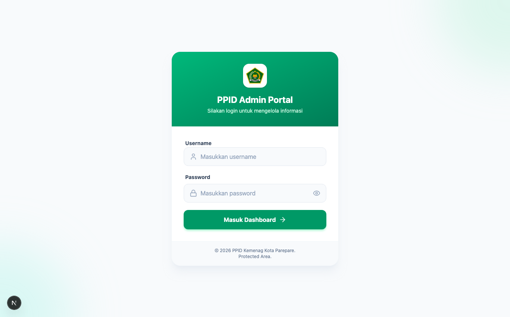

### Rincian Arsitektur Keamanan Autentikasi:
1. **Isolasi Rute:** Modul login berada pada `/login`, terpisah secara ketat dari portal publik `/`.
2. **Next.js Server Actions:** Seluruh pemrosesan kredensial dijalankan di sisi server (`app/actions/auth.ts`). Kredensial tidak pernah diproses di client-side JavaScript.
3. **Mitigasi Brute-Force:** Server menerapkan *artificial delay* (penundaan waktu acak terukur 800 ms) pada setiap request login untuk meredam serangan otomatisasi kamus kata sandi (*dictionary attacks*).
4. **Cookie Sesi Terenkripsi (`admin_session_token`):**
   - Atribut `httpOnly: true`: Cookie terlindung dari akses script JavaScript peramban, mencegah pencurian cookie melalui serangan Cross-Site Scripting (XSS).
   - Atribut `sameSite: 'strict'`: Melindungi request dari serangan Cross-Site Request Forgery (CSRF).
   - Masa Kedaluwarsa Sesi: Cookie sesi dibatasi maksimal **24 jam**. Setelah itu, admin wajib mengautentikasi ulang.
5. **Prosedur Keluar Aman (Logout):** Admin wajib mengklik tombol **Keluar / Logout** pada pojok kanan bawah bilah navigasi ketika selesai bekerja, terutama jika menggunakan komputer bersama di kantor.

---

## 6. Eksplorasi Panel Kontrol Dashboard Utama & Indikator Kinerja (KPI)

Setelah berhasil masuk, Super Admin diarahkan ke panel kendali utama berbasis kartu dinamis (*Bento Grid*) yang modern, elegan, dan informatif.

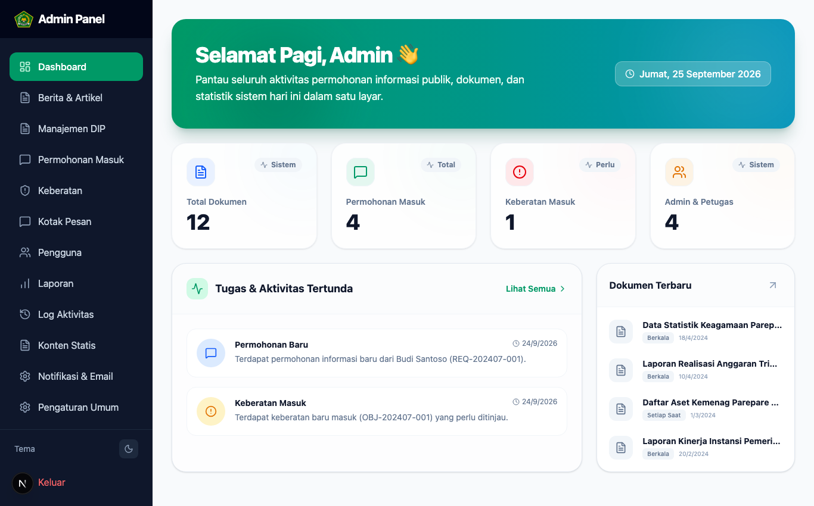

### Komponen Panel Kendali:
1. **Header Sambutan Kontekstual:** Menampilkan sapaan dinamis sesuai waktu kerja (Pagi/Siang/Sore/Malam), tanggal kalender Masehi, dan indikator status kesiapan sistem (*Live Status*).
2. **Kartu Key Performance Indicators (KPI):**
   - **Total Berita:** Menghitung jumlah warta yang telah diterbitkan (mengukur produktivitas media informasi kantor).
   - **Dokumen DIP:** Jumlah dokumen resmi yang tersedia untuk diunduh publik (indikator kepatuhan keterbukaan informasi).
   - **Permohonan Masuk:** Jumlah berkas warga yang sedang dalam tahap verifikasi atau penyusunan dokumen jawaban.
   - **Keberatan Aktif:** Jumlah sanggahan warga yang memerlukan penetapan keputusan segera oleh Atasan PPID.
3. **Bilah Navigasi Samping (Sidebar Menu):** Memungkinkan admin berpindah antar modul kerja dengan satu sentuhan klik. Dilengkapi penanda rute aktif (*active state indicator*) yang elegan.

---

## 7. Petunjuk Teknis Modul Warta & Berita Kegiatan (Media Kehumasan)

Modul ini digunakan oleh tim pranata humas dan admin untuk mempublikasikan warta kegiatan keagamaan resmi di Kota Parepare.

### Tampilan Tabel Berita
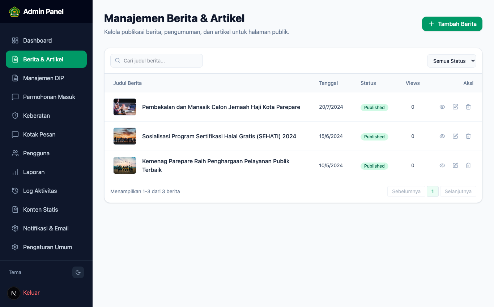

### Formulir Tambah & Edit Berita (Live Photo Picker)
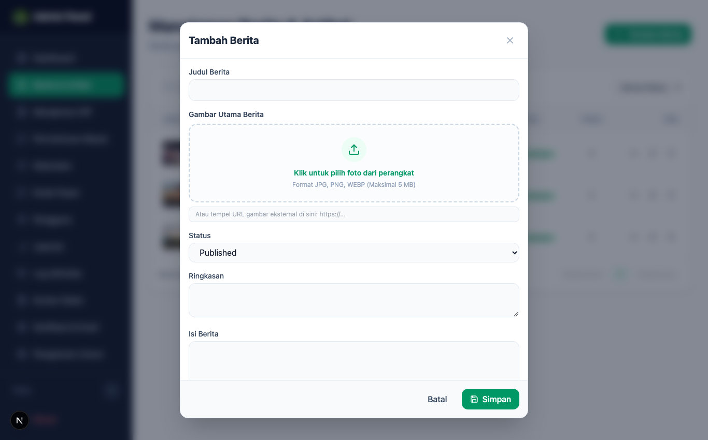

### Panduan Redaksional & Langkah Kerja:
1. **Standar Penulisan Berita:**
   - Gunakan kaidah jurnalistik 5W + 1H (What, Who, Where, When, Why, How).
   - Sertakan judul yang lugas, representatif, dan memuat nama kegiatan serta instansi.
2. **Panduan Unggah Foto Kegiatan:**
   - Format Berkas: `.jpg`, `.jpeg`, `.png`, atau `.webp`.
   - Dimensi Ideal: Rasio layar **16:9** (resolusi optimal `1200 x 675 piksel`).
   - Batas Ukuran: Di bawah **2 MB per foto** agar pemuatan halaman di ponsel warga berlangsung kilat.
   - Foto otomatis diunggah ke Supabase Cloud Storage bucket `berita` dan menghasilkan URL CDN permanen.
3. **Manajemen Status Berita:**
   - `Published`: Berita langsung tayang di portal depan `/berita`.
   - `Draft`: Artikel disimpan sebagai rancangan kerja dan belum dapat diakses oleh publik.

---

## 8. Petunjuk Teknis Pengelolaan Daftar Informasi Publik (DIP) & Upload Berkas

Daftar Informasi Publik (DIP) adalah nyawa utama transparansi badan publik. Modul ini mengelola katalog berkas resmi yang dapat diunduh langsung oleh masyarakat.

### Tampilan Manajemen Dokumen DIP
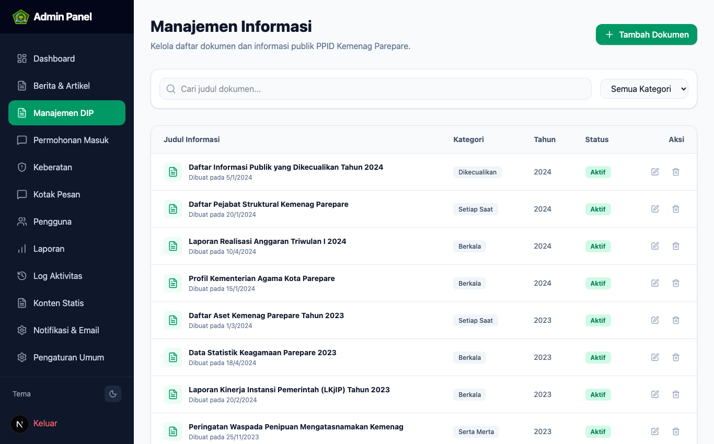

### Formulir Tambah Dokumen DIP (Live Upload PDF/DOCX/XLSX)
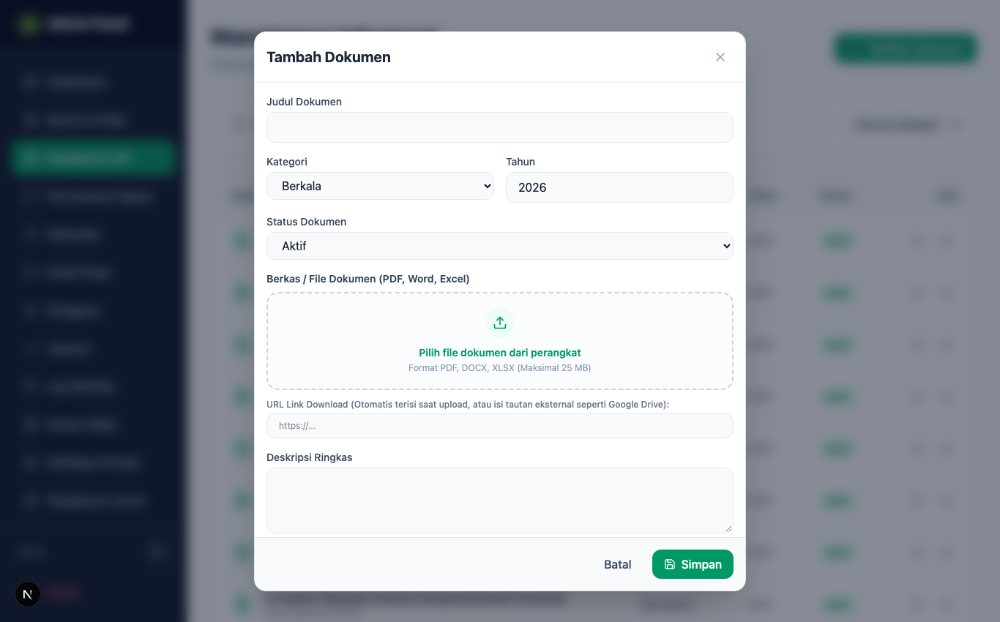

### Klasifikasi 4 Kategori Dokumen (Pasal 9-17 UU KIP):
1. **Informasi Berkala:** Dokumen yang wajib dimutakhirkan secara rutin. Contoh: Rencana Strategis (Renstra), Laporan Kinerja Instansi Pemerintah (LKjIP), Laporan Keuangan Tahunan, RKA-K/L, dan Statistik Keagamaan Kota Parepare.
2. **Informasi Setiap Saat:** Dokumen operasional yang selalu tersedia. Contoh: Standar Operasional Prosedur (SOP) Nikah di KUA, SOP Pengukuran Kiblat, SOP Layanan PTSP, Daftar Inventaris Aset/BMN, dan Profil Pejabat Struktural.
3. **Informasi Serta Merta:** Informasi darurat yang menyangkut hajat hidup orang banyak. Contoh: Peringatan penipuan sumbangan ibadah/pesantren mengatasnamakan Kemenag, imbauan protokol ibadah saat bencana alam.
4. **Informasi Dikecualikan:** Dokumen rahasia yang tidak dapat diakses publik karena dapat membahayakan keamanan negara atau merugikan hak pribadi. Wajib melalui prosedur Uji Konsekuensi.

### Field-by-Field Panduan Unggah Dokumen:
* **Judul Dokumen:** Cantumkan nama resmi dokumen beserta tahun penerbitan (misal: *Laporan Kinerja Instansi Pemerintah (LKjIP) Tahun 2025*).
* **Kategori:** Pilih salah satu dari 4 opsi klasifikasi di atas.
* **Deskripsi Singkat:** Uraikan ringkasan cakupan dokumen dalam 1-2 paragraf.
* **Penanggung Jawab / Pembuat Data:** Cantumkan seksi/satker penyedia data (misal: *Subbagian Tata Usaha* atau *Seksi Penmad*).
* **Unggah Berkas Dokumen:** Pilih berkas dari komputer (didukung format `.pdf`, `.docx`, `.xlsx`). Berkas langsung tersimpan di Supabase Cloud Storage bucket `dokumen`.

---

## 9. Standar Operasional Prosedur (SOP) Uji Konsekuensi Informasi Publik

Berdasarkan Pasal 17 UU KIP dan PMA No. 9 Tahun 2022, badan publik tidak boleh serta merta menolak permintaan informasi tanpa didasari oleh **Uji Konsekuensi** yang sah.

```
                    ┌──────────────────────────────────────┐
                    │      PERMOHONAN BERPOTENSI RAHASIA   │
                    └──────────────────┬───────────────────┘
                                       │
                    ┌──────────────────▼───────────────────┐
                    │      PENGUJIAN KONSEKUENSI BAHAYA    │
                    │        (Harm & Consequence Test)     │
                    └──────────────────┬───────────────────┘
                                       │
                    ┌──────────────────▼───────────────────┐
                    │  PERTIMBANGAN KEPENTINGAN PUBLIK     │
                    │         (Public Interest Test)       │
                    └──────────────────┬───────────────────┘
                                       │
                    ┌──────────────────▼───────────────────┐
                    │     PENETAPAN BERITA ACARA UJI       │
                    │         (Ditandatangani Atasan PPID) │
                    └──────────────────────────────────────┘
```

### Kriteria Informasi yang Dikecualikan (Pasal 17 UU KIP):
1. Menghambat proses penegakan hukum atau audit pengawasan internal.
2. Mengungkap rahasia pribadi seseorang tanpa persetujuan tertulis (seperti riwayat medis, nomor rekening perbankan, dan data privasi keluarga).
3. Mengungkap rahasia jabatan atau dokumen naskah soal ujian dinas yang belum dilaksanakan.

---

## 10. Petunjuk Teknis Konten Statis Profil & Struktur Organisasi Dinamis

Modul Konten Statis (`/dashboard/konten-statis`) memberikan kewenangan penuh kepada Super Admin untuk memperbarui data profil tanpa menyentuh kode program sumber Next.js.

### Tab 1: Profil PPID, Visi & Misi, Maklumat Pelayanan
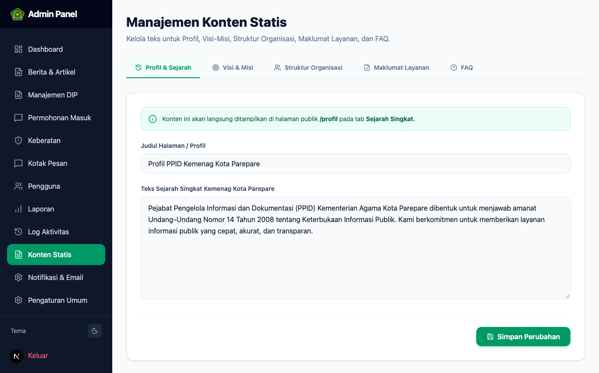

* **Dual-Sync Database:** Sistem secara otomatis menyelaraskan perubahan teks ke tabel `konten_statis` dan tabel JSONB `profil_konten`, menjamin data selalu konsisten di seluruh halaman portal publik.

### Tab 2: Struktur Organisasi Dinamis (4 Sub-Kategori)
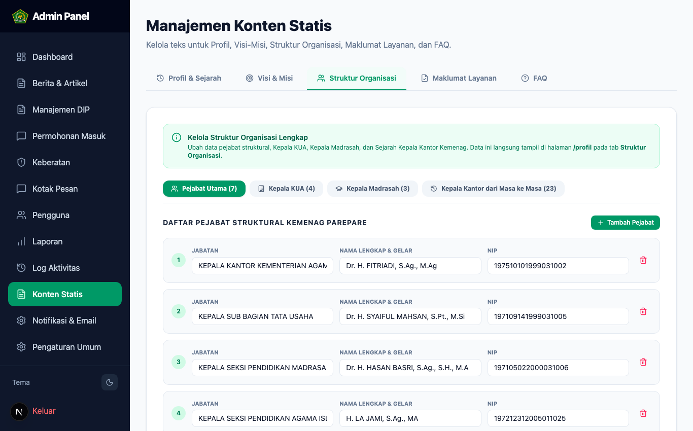

Super Admin dapat mengelola data personalia pejabat melalui 4 tab sub-kategori:
1. **Pejabat Utama Kantor:** Kepala Kantor, Kepala Subbag TU, Kasi Penmad, Kasi PAIS, Kasi Bimas Islam, Kasi PD Pontren, Kasi PHU, dan Penyelenggara Zawa.
2. **Kepala KUA Kecamatan:** Pimpinan KUA Kecamatan Bacukiki, KUA Bacukiki Barat, KUA Soreang, dan KUA Ujung.
3. **Kepala Madrasah Negeri:** Kepala MAN 1 Kota Parepare, Kepala MAN 2 Kota Parepare, dan Kepala MTsN Kota Parepare.
4. **Kepala Kantor dari Masa ke Masa:** Kronologi 23 pimpinan kantor dari era awal pembentukan hingga kepemimpinan saat ini.

---

## 11. SOP Pelayanan Permohonan Informasi Publik (Linimasa 10 + 7 Hari Kerja)

Setiap permohonan informasi publik yang diajukan oleh masyarakat wajib diselesaikan sesuai dengan batas waktu ketat yang diatur oleh UU KIP:

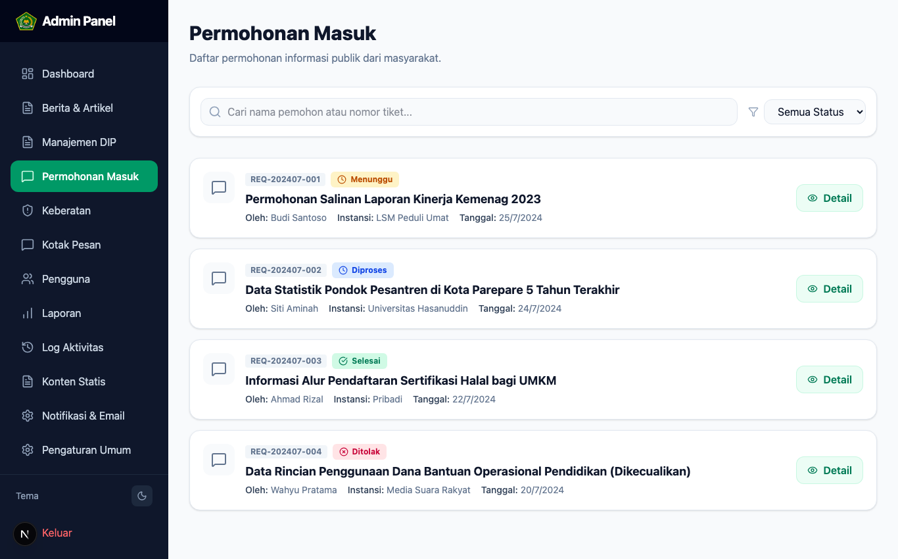

```
[Hari ke-1 s/d 3]   : Verifikasi kelengkapan KTP dan kejelasan rincian permohonan.
[Hari ke-4 s/d 8]   : Koordinasi internal dan disposisi ke Seksi pemilik data.
[Hari ke-9 s/d 10]  : Penerbitan Surat Pemberitahuan Tertulis (Disetujui/Ditolak/Diperpanjang).
[Hari ke-11 s/d 17] : Perpanjangan waktu maksimal 7 hari kerja dengan alasan tertulis sah.
```

### Panduan Tindakan Super Admin di Sistem:
1. Buka menu `/dashboard/permohonan`.
2. Klik tombol **Lihat Detail** pada permohonan yang berstatus `Menunggu Verifikasi`.
3. Teliti lampiran foto KTP: Pastikan NIK, nama lengkap, dan foto wajah terbaca dengan jelas.
4. Perbarui status tindak lanjut:
   - 🟡 `Menunggu Verifikasi`: Berkas baru masuk dari website publik.
   - 🔵 `Sedang Diproses`: Permohonan telah divalidasi dan berkas sedang disiapkan oleh Seksi terkait.
   - 🟢 `Disetujui`: Berkas telah siap diunduh secara digital atau diambil di loket PTSP.
   - 🔴 `Ditolak`: Permohonan ditolak karena dokumen dikecualikan (wajib menginput alasan penolakan tertulis pada kolom catatan).

---

## 12. SOP Penanganan Pengajuan Keberatan (Batas Waktu Maksimal 30 Hari Kerja)

Keberatan adalah hak pemohon untuk menyanggah pelayanan PPID yang disampaikan langsung kepada **Atasan PPID** (Kepala Kantor Kemenag Kota Parepare).

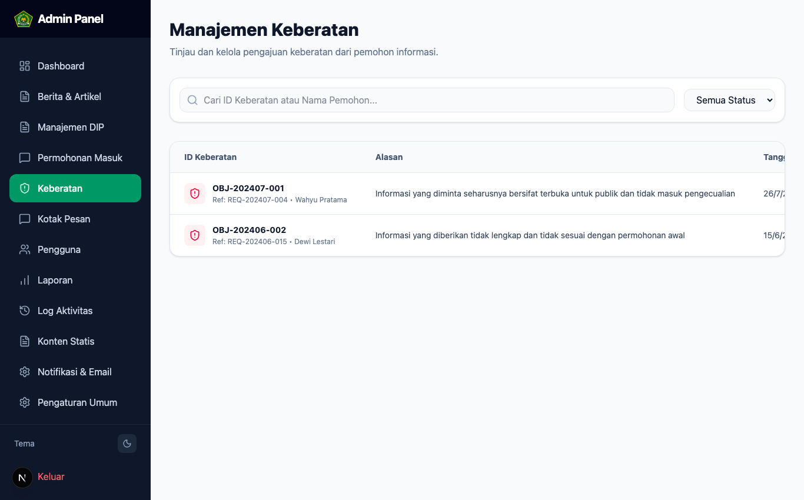

### Prosedur Penyelesaian Keberatan:
1. Buka menu `/dashboard/keberatan`.
2. Buka berkas sanggahan pemohon dan pelajari riwayat nomor tiket permohonan awalnya.
3. Rangkum kasus posisi dan sampaikan berkas telaah ke Atasan PPID.
4. Atasan PPID memanggil pihak terkait atau menetapkan keputusan tanggapan tertulis paling lambat **30 (tiga puluh) hari kerja** sejak keberatan teregistrasi.
5. Super Admin menginput **Tanggapan Resmi Atasan PPID** ke dalam sistem dan mencetak Surat Keputusan Tanggapan Keberatan (Model E).

---

## 13. Pengaturan Profil Lembaga, Variabel Kontak & Operasional PTSP

Modul Pengaturan (`/dashboard/pengaturan`) mengelola variabel konfigurasi global yang memicu tampilan di seluruh halaman portal publik.

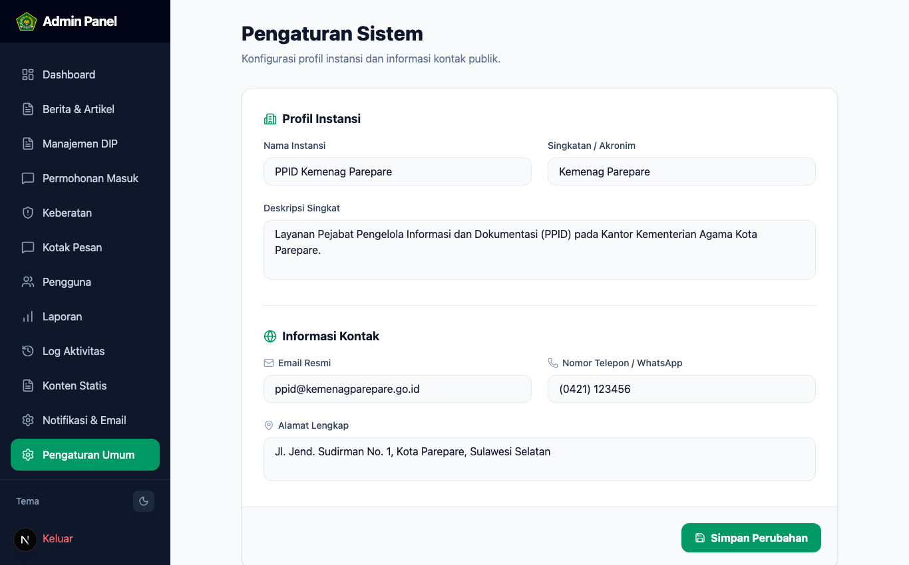

### Rincian Variabel Konfigurasi:
* **Nama Satuan Kerja:** `Kantor Kementerian Agama Kota Parepare`
* **Alamat Fisik:** `Jl. Jend. Sudirman No.KM. 3, Bumi Harapan, Kec. Bacukiki Barat, Kota Parepare, Sulawesi Selatan 91122`
* **Email Resmi:** `ppid.pareparedev@gmail.com` / `kemenagparepare@kemenag.go.id`
* **Nomor WhatsApp Helpdesk:** `+62 821-9000-xxxx` (terintegrasi langsung ke tombol chat warga di beranda).
* **Jam Pelayanan PTSP:**
  - Senin – Kamis: 08.00 – 16.00 WITA (Istirahat 12.00 – 13.00 WITA)
  - Jumat: 08.00 – 16.30 WITA (Istirahat 11.30 – 13.30 WITA)

---

## 14. Arsitektur Basis Data, Skema 14 Tabel Relasional & Supabase Cloud Storage

Aplikasi berjalan di atas arsitektur modern Next.js 15 (App Router) yang terhubung ke cloud database **Supabase PostgreSQL** (`bstmvwuujawlulbtzthh`).

### Skema 14 Tabel Relasional Database:
1. `berita`: Menyimpan judul warta, slug unik, kategori, ringkasan, isi konten, link foto, dan status (*Published/Draft*).
2. `informasi_publik`: Menyimpan katalog DIP, nomor dokumen, kategori (Berkala/Setiap Saat/Serta Merta/Dikecualikan), link storage, ukuran file, dan jumlah unduhan.
3. `konten_statis`: Menyimpan teks profil PPID, visi, misi, dan ikrar maklumat pelayanan.
4. `profil_konten`: Format JSONB fleksibel untuk struktur organisasi, pejabat KUA, kepala madrasah, dan kronologi 23 pimpinan kantor dari masa ke masa.
5. `permohonan`: Data permohonan masuk, nomor tiket registrasi, NIK, nama pemohon, kontak HP/WA, email, foto KTP, rincian informasi yang diminta, status proses, dan catatan disposisi.
6. `keberatan`: Data pengajuan keberatan warga, nomor tiket referensi, poin alasan keberatan, alasan detail, status, dan tanggapan tertulis Atasan PPID.
7. `faqs`: Daftar pertanyaan umum beserta jawaban resmi seputar pelayanan PPID.
8. `galeri`: Dokumentasi foto kegiatan pelayanan keagamaan dan loket PTSP.
9. `regulasi`: Kumpulan produk hukum dan regulasi keterbukaan informasi.
10. `pengaturan`: Variabel global nama instansi, alamat, email, WhatsApp, dan jam layanan.
11. `notifikasi`: Antrean pesan notifikasi real-time di bilah atas panel admin.
12. `pengguna`: Akun data administrator sistem dan role hak akses.
13. `log_aktivitas`: Rekam jejak audit trail seluruh aktivitas perubahan data di panel admin.
14. `pesan`: Kotak masuk aspirasi, saran, dan pertanyaan warga dari halaman kontak.

### Konfigurasi Supabase Storage Bucket:
* **Bucket `berita`:** Penyimpanan berkas foto artikel berita dengan akses publik dan optimasi CDN.
* **Bucket `dokumen`:** Penyimpanan berkas dokumen DIP (PDF, DOCX, XLSX) dengan akses publik untuk memudahkan unduhan masyarakat.

---

## 15. Protokol Keamanan Siber, Kebijakan RLS & Rencana Tanggap Insiden

1. **Row Level Security (RLS) PostgreSQL:** Seluruh 14 tabel dilindungi oleh kebijakan RLS. Operasi baca terbuka untuk publik pada tabel konten umum, sedangkan operasi insert, update, dan delete diproteksi secara ketat bagi sesi admin yang terautentikasi.
2. **Kerahasiaan Kredensial Lingkungan (.env):** Kunci `SUPABASE_SERVICE_ROLE_KEY` dan `SUPABASE_PERSONAL_ACCESS_TOKEN` wajib dijaga kerahasiaannya dan tidak boleh diunggah ke repositori publik.
3. **Pencadangan Basis Data Berkala:** Lakukan backup SQL secara terjadwal melalui dashboard Supabase atau scratch script ekspor data secara berkala setiap akhir bulan.
4. **Rencana Tanggap Insiden (Incident Response Plan):**
   - Jika terdeteksi akses mencurigakan, segera ganti kata sandi admin di menu profil/pengguna.
   - Apabila terjadi kesalahan penghapusan dokumen, pulihkan data melalui snapshot backup database Supabase.

---

## 16. Format Baku Administrasi & Formulir Resmi Kemenag (Model A s/d G)

Untuk menjamin keseragaman administrasi, sistem mengadopsi format resmi Kementerian Agama RI:

### Formulir Model B: Surat Pemberitahuan Tertulis Permohonan Informasi
```text
KOP SURAT KEMENTERIAN AGAMA KOTA PAREPARE
Nomor       : B-    /Kk.21.16/HM.00/xx/2026
Sifat       : Biasa
Lampiran    : 1 (satu) Berkas
Hal         : Pemberitahuan Tertulis Permohonan Informasi Publik

Kepada Yth.
[Nama Pemohon Informasi]
Di - Tempat

Sehubungan dengan permohonan informasi publik Saudara dengan nomor tiket registrasi [NOMOR TIKET] tanggal [TANGGAL REGISTRASI], dengan ini kami sampaikan:
1. Informasi yang dimohonkan berada di bawah penguasaan Kantor Kementerian Agama Kota Parepare.
2. Bentuk fisik salinan informasi yang disediakan: [Softcopy Digital / Cetak Fisik].
3. Biaya perolehan informasi: Rp 0,- (Nol Rupiah / GRATIS).
4. Berkas informasi dapat diunduh melalui portal web atau diambil di loket PTSP Kantor Kemenag Kota Parepare pada jam kerja.

Demikian pemberitahuan ini kami sampaikan untuk dipergunakan sebagaimana mestinya.

Parepare, [Tanggal Penetapan]
Ketua PPID Kemenag Kota Parepare,

[Tanda Tangan & Cap Dinas Resmi]
NIP. ..............................
```

### Formulir Model E: Surat Keputusan Tanggapan Keberatan Atasan PPID
```text
KOP SURAT KEMENTERIAN AGAMA KOTA PAREPARE
KEPUTUSAN ATASAN PPID KEMENTERIAN AGAMA KOTA PAREPARE
NOMOR: B-    /Kk.21.16/HM.00/xx/2026

TENTANG
TANGGAPAN ATAS KEBERATAN PEMOHONAN INFORMASI PUBLIK

ATASAN PPID KEMENTERIAN AGAMA KOTA PAREPARE,

Menimbang   : a. bahwa pemohon atas nama [NAMA PEMOHON] telah mengajukan keberatan;
              b. bahwa setelah dilakukan penelitian dan pemeriksaan seksama...
Mengingat   : 1. Undang-Undang Nomor 14 Tahun 2008;
              2. Peraturan Menteri Agama Nomor 9 Tahun 2022;

MEMUTUSKAN:
Menetapkan  : 
KESATU      : [MENGABULKAN / MENOLAK] permohonan keberatan yang diajukan oleh Pemohon.
KEDUA       : Memerintahkan kepada Ketua PPID untuk [menyerahkan berkas / menyampaikan alasan penolakan].
KETIGA      : Keputusan ini berlaku sejak tanggal ditetapkan.

Ditetapkan di Parepare pada tanggal [TANGGAL]
Kepala Kantor Kemenag Kota Parepare / Atasan PPID,

Dr. H. FITRIADI, S.Ag., M.Ag
NIP. 197510101999031002
```

---

## 17. Checklist Kerja Harian, Mingguan & Bulanan Administrator PPID

### A. Checklist Harian (Setiap Hari Kerja):
* [ ] Login ke `/dashboard` pada pukul 08.30 WITA dan periksa notifikasi permohonan baru.
* [ ] Lakukan verifikasi identitas KTP pemohon pada menu `/dashboard/permohonan`.
* [ ] Cek permohonan yang mendekati tenggat waktu (H-3 dari batas 10 hari kerja).
* [ ] Pantau kotak masuk pengajuan keberatan pada `/dashboard/keberatan`.

### B. Checklist Mingguan:
* [ ] Publikasikan minimal 2 artikel liputan warta keagamaan terbaru di `/dashboard/berita`.
* [ ] Periksa kelengkapan berkas unduhan dokumen DIP pada `/dashboard/informasi`.
* [ ] Tinjau pesan masuk warga pada menu kontak dan berikan respon informatif.

### C. Checklist Bulanan:
* [ ] Rekapitulasi jumlah permohonan informasi dan keberatan yang masuk selama satu bulan.
* [ ] Buat laporan statistik kepuasan layanan informasi untuk dilaporkan ke Atasan PPID.
* [ ] Lakukan pencadangan (backup) data database dan dokumen Supabase Storage.

---

## 18. Panduan Troubleshooting & Penanganan Insiden Teknis Mandiri

| Gejala Gangguan | Penyebab Teknis | Langkah Penanganan Mandiri Super Admin |
| :--- | :--- | :--- |
| **Gagal Menyimpan Data Konten / Profil** | Jaringan internet kantor terputus atau sesi admin kedaluwarsa. | Periksa kabel LAN / WiFi, muat ulang peramban (*refresh*), dan login kembali jika sesi telah lewat 24 jam. |
| **Gagal Mengunggah Foto Berita** | Ukuran file foto melebihi 3 MB atau format file bukan gambar. | Kecilkan resolusi gambar menjadi maksimal 1200x675 piksel dengan format `.jpg` atau `.png` (ukuran < 2 MB). |
| **Gagal Mengunggah Berkas Dokumen DIP** | File dokumen sedang terbuka dan terkunci di Microsoft Word/Excel. | Tutup aplikasi Microsoft Word/Excel yang sedang membuka berkas tersebut di laptop sebelum mengunggah. |
| **Sesi Login Sering Keluar Sendiri** | Browser disetel dalam mode *Private/Incognito* tanpa cookie persistent. | Gunakan mode peramban reguler dan pastikan izin penyimpanan cookie peramban diaktifkan. |
| **Perubahan Data Belum Muncul di Portal Publik** | Peramban menyimpan berkas cache lokal yang lama. | Lakukan *Hard Reload* dengan menekan tombol `Ctrl + F5` (Windows) atau `Cmd + Shift + R` (Mac). |
| **Pemohon Mengeluh Nomor Tiket Tidak Ditemukan** | Salah ketik nomor tiket (misal: tertukar angka 0 dan huruf O). | Periksa daftar permohonan di panel admin `/dashboard/permohonan`, cari berdasarkan nama pemohon, dan verifikasi nomor tiket yang tepat. |

---

*Hak Cipta © 2026 PPID Kantor Kementerian Agama Kota Parepare. Standar Operasional Resmi Administrator Portal Informasi Publik.*
